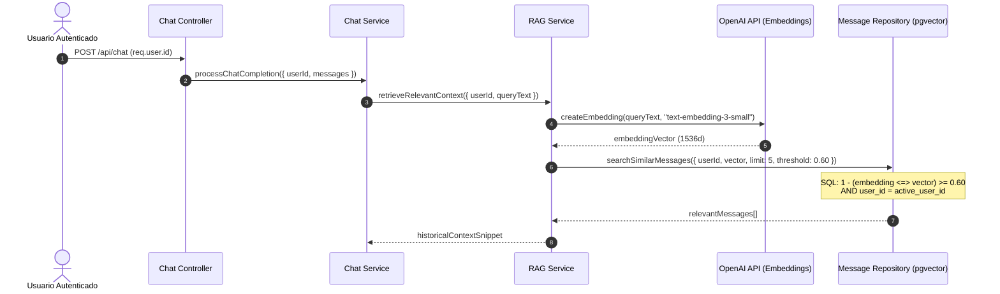
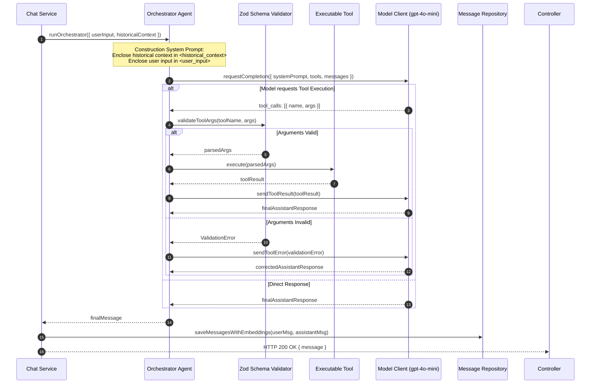

# Spec 007: Orquestación LLM, Memoria RAG Semántica y Tool Calling (ADR 0004 & ADR 0005)

## Fase 1: Requisitos & Análisis de Impacto (`/speckit.analyze`)

### Impact Report (Radiografía Inicial & Formato Delta SDD)

#### 1. Contexto Brownfield y Estado Actual
Actualmente, el backend cuenta con persistencia PostgreSQL (`conversations`, `messages` con columna `embedding vector(1536)` e índice HNSW) y autenticación JWT con aislamiento por usuario. Sin embargo, la capa de chat (`chat.service.mjs`) realiza llamadas directas y simples a `model-client.mjs` sin recuperar contexto vectorial histórico (RAG), sin estructurar los prompts en XML para mitigar Prompt Injections y sin un motor de orquestación que gestione la ejecución de herramientas (Tool Calling) validadas por esquemas Zod en tiempo de ejecución.

#### 2. Radiografía Delta de Cambios (Formato Delta SDD Estricto):
- **[+] ADDED**: `apps/api/src/agents/orchestrator.agent.mjs` (Motor de razonamiento LLM, ensamblado de prompts aislados y bucle de ejecución de herramientas).
- **[+] ADDED**: `apps/api/src/agents/tools/` (Definición de herramientas ejecutables por el agente).
- **[+] ADDED**: `apps/api/src/services/rag.service.mjs` (Generación de embeddings con `text-embedding-3-small` y consulta semántica a `message.repository.mjs`).
- **[+] ADDED**: `apps/api/src/schemas/tool.schema.mjs` (Validación de esquemas Zod en tiempo de ejecución para parámetros de herramientas).
- **[~] MODIFIED**: `apps/api/src/services/chat.service.mjs` (Integración del flujo completo: verificación de conversación, RAG, orquestador LLM y persistencia de mensajes con embeddings).
- **[~] MODIFIED**: `apps/api/src/repositories/message.repository.mjs` (Soporte completo para guardar mensajes con vector embeddings y ejecutar búsquedas por coseno con filtro `user_id`).
- **[=] UNTOUCHED**: `apps/api/src/middlewares/auth.middleware.mjs` (Seguridad JWT intacta).
- **[=] UNTOUCHED**: `apps/api/src/controllers/chat.controller.mjs` (Contrato HTTP `/api/chat` preservado).
- **[-] REMOVED**: `apps/api/src/agents/.gitkeep`

#### 3. Preservación e Invariantes
- Conservación total de contratos HTTP existentes (`POST /api/chat` recibe `{ messages }` y retorna `{ ok: true, message: { role, content } }`).
- Invariante de seguridad: Ningún mensaje de otro usuario puede ser recuperado durante la búsqueda vectorial de RAG (`WHERE user_id = active_user_id`).
- Resiliencia: Si el servicio de embeddings o PostgreSQL experimenta una degradación, el agente continuará respondiendo apoyándose en el historial de la conversación activa sin interrumpir el servicio.

---

### Criterios de Aceptación (Notación EARS Conductual)

* **Mientras** un usuario autenticado envíe un mensaje a `POST /api/chat`, **cuando** el sistema procese la petición, **el sistema debe** generar la incrustación vectorial del mensaje del usuario utilizando el modelo `text-embedding-3-small` y consultar la base de datos PostgreSQL mediante búsqueda por coseno (`pgvector`).

* **Mientras** existan mensajes previos del mismo usuario en la base de datos, **cuando** la búsqueda vectorial retorne resultados, **el sistema debe** filtrar estrictamente por `user_id = active_user_id` y seleccionar únicamente los 5 mensajes más relevantes (`Top K = 5`) que superen o igualen el umbral de similitud `minSimilarity >= 0.60`.

* **Cuando** el orquestador construya el Prompt de Sistema para el modelo LLM, **el sistema debe** aislar las entradas del usuario dentro de etiquetas XML `<user_input>` y el contexto de memoria recuperado dentro de etiquetas XML `<historical_context>` para prevenir Prompt Injections.

* **Cuando** el modelo LLM determine la necesidad de invocar una herramienta externa (Tool Calling), **el sistema debe** validar los argumentos entregados por el modelo usando un esquema Zod en tiempo de ejecución antes de ejecutar la función correspondiente.

* **Cuando** la herramienta ejecute con éxito o devuelva un error, **el sistema debe** inyectar el resultado de la herramienta de vuelta al modelo LLM para que sintetice la respuesta final al usuario.

* **Cuando** el flujo de procesamiento finalice, **el sistema debe** persistir tanto el mensaje del usuario como la respuesta del asistente (junto con sus respectivos vectores embeddings) en la tabla `messages` de PostgreSQL.

---

### Representación Arquitectónica & Flujos de Datos

#### Diagrama 1: Flujo RAG & Recuperación Semántica Cross-Conversation

#### Diagrama 2: Bucle de Orquestación LLM, Aislamiento Prompt & Tool Calling

---

### Guardarraíles de Seguridad & Límites Cuantitativos

1. **Parámetros RAG Vectoriales**:
   - Dimensiones del vector: `1536` (`text-embedding-3-small`).
   - Límite de coincidencia: `Top K = 5`.
   - Umbral de similitud por coseno: `>= 0.60`.
2. **Defensa Prompt Injection**:
   - Envasado obligatorio en XML: `<user_input>` y `<historical_context>`.
   - Formateo estricto del rol `system` administrado exclusivamente por el backend.
3. **Límites de Ejecución y Timeouts**:
   - Timeout de petición al modelo: `MODEL_REQUEST_TIMEOUT_MS = 60000` (60 seg).
   - Máximo de mensajes procesados por sesión: `MAX_MESSAGES = 30`.
   - Longitud de caracteres por mensaje: `1` a `8000` caracteres.

