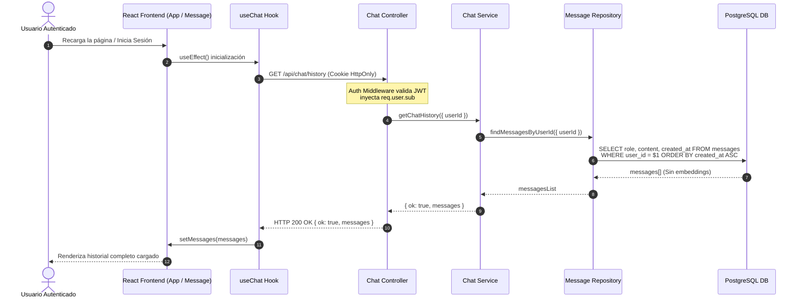
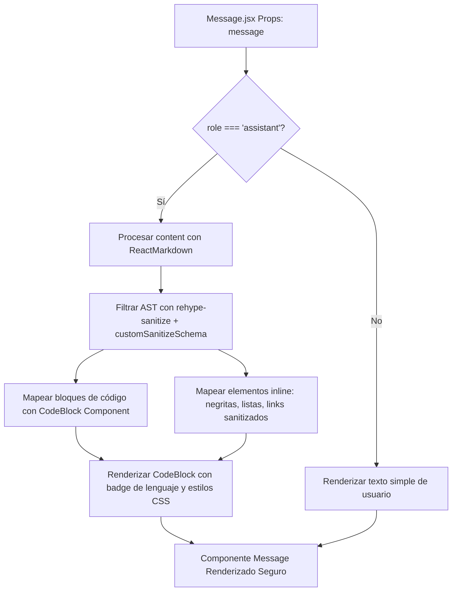

# Spec 008: Composición Frontend/Backend, Sincronización de Historial y Renderizado Markdown

## Fase 1: Requisitos & Análisis de Impacto (`/speckit.analyze`)

### Impact Report (Radiografía Inicial & Formato Delta SDD)

#### 1. Contexto Brownfield y Estado Actual
Actualmente, el backend de Express.js expone endpoints de autenticación (`/api/auth/*`) y envío de mensajes (`POST /api/chat`), persistiendo usuarios, conversaciones y mensajes en PostgreSQL. Sin embargo, al recargar la aplicación React en el frontend (`apps/web`), el hook `useChat.js` inicializa la conversación local con un arreglo de mensajes vacío `[]`, ignorando los mensajes almacenados previamente en la base de datos (desincronización de estado o "History Amnesia").
Adicionalmente, las respuestas generadas por los modelos LLM contienen sintaxis Markdown (bloques de código ` ``` `, negritas, listas), pero el componente `Message.jsx` actual las renderiza como texto plano sin formatear, degradando la experiencia visual de la interfaz.

#### 2. Radiografía Delta de Cambios (Formato Delta SDD Estricto):
- **[+] ADDED**: `GET /api/chat/history` endpoint en `apps/api/src/routes/chat.routes.mjs` para recuperar el historial persistido del usuario.
- **[+] ADDED**: `apps/web/src/components/chat/Message.test.jsx` (suite de pruebas unitarias para renderizado seguro de Markdown).
- **[+] ADDED**: `apps/api/test/controllers/chat.history.test.mjs` (test de integración backend para el endpoint de historial).
- **[~] MODIFIED**: `apps/api/src/controllers/chat.controller.mjs` (añadir controlador `handleGetHistory` con protección de autenticación JWT).
- **[~] MODIFIED**: `apps/api/src/services/chat.service.mjs` (función `getChatHistory` para consultar mensajes de la conversación activa del usuario).
- **[~] MODIFIED**: `apps/api/src/repositories/message.repository.mjs` (consulta `findMessagesByUserId` excluyendo la columna `embedding` para optimizar ancho de banda).
- **[~] MODIFIED**: `apps/web/src/hooks/useChat.js` (efecto de inicialización para realizar `fetch` a `/api/chat/history` cuando el usuario está autenticado).
- **[~] MODIFIED**: `apps/web/src/components/chat/Message.jsx` (integración del renderizado enriquecido de Markdown y bloques de código con `react-markdown` y `rehype-sanitize`).
- **[=] UNTOUCHED**: `apps/api/src/middlewares/auth.middleware.mjs` (mapeo e inyección de `req.user.sub` intacto).
- **[=] UNTOUCHED**: Estructura de tablas relacionales en PostgreSQL (`users`, `conversations`, `messages`).
- **[-] REMOVED**: N/A.

#### 3. Preservación e Invariantes
- Conservación total de contratos HTTP existentes (`POST /api/chat`, `POST /api/auth/login`, `POST /api/auth/logout`, `GET /api/auth/me`).
- Invariante de Aislamiento de Inquilinos (Tenant Isolation): El historial retornado por `GET /api/chat/history` debe filtrar strictly por el `user_id` del token JWT activo (`WHERE user_id = active_user_id`).
- Optimización de Ancho de Banda: El campo `embedding` (vector de 1536 dimensiones) NUNCA debe ser incluido en la respuesta JSON de historial enviado al navegador.
- Resiliencia en UI: Si el endpoint de historial falla o retorna un error de red, el frontend React debe capturar el error limpiamente y permitir al usuario enviar nuevos mensajes sin bloquear la interfaz.

---

### Criterios de Aceptación (Notación EARS Conductual)

* **Mientras** un usuario autenticado abra o recargue la aplicación frontend React, **cuando** el hook `useChat` se inicialice con una sesión válida, **el sistema debe** realizar una petición `GET /api/chat/history` para cargar el historial de mensajes de la conversación activa del usuario.

* **Mientras** la API procese una petición `GET /api/chat/history`, **cuando** consulte la base de datos PostgreSQL, **el sistema debe** filtrar los mensajes por `user_id = active_user_id`, ordenarlos cronológicamente por `created_at ASC`, excluir la columna `embedding` y retornar un payload JSON estructurado `{ ok: true, messages: [...] }`.

* **Mientras** el usuario no esté autenticado, **cuando** intente acceder a `GET /api/chat/history`, **el sistema debe** responder inmediatamente con HTTP 401 Unauthorized sin consultar la base de datos.

* **Cuando** el componente `Message.jsx` reciba un mensaje que contenga sintaxis Markdown (encabezados, listas, negritas, bloques de código), **el sistema debe** renderizar los elementos HTML estructurados con estilos coherentes al sistema de diseño.

* **Cuando** un bloque de código sea renderizado dentro de un mensaje del asistente, **el sistema debe** presentar el contenedor de código con sintaxis resaltada/formateada y un diseño visual limpio sin interpretar etiquetas scripts no deseadas.

---

### Representación Arquitectónica & Flujos de Datos

#### Diagrama 1: Flujo de Hidratación de Historial (Inicialización useChat)


#### Diagrama 2: Pipeline de Renderizado Markdown en Componentes UI


---

### Guardarraíles de Seguridad & Límites Cuantitativos

1. **Aislamiento Multi-inquilino (Tenant Isolation)**:
   - Cláusula SQL obligatoria `WHERE user_id = active_user_id`.
   - Prohibido exponer mensajes de otros usuarios bajo cualquier circunstancia.
2. **Eficiencia del Payload**:
   - Exclusión explícita del vector embedding de 1536 dimensiones en la consulta `SELECT`.
   - Límite de mensajes por consulta de historial: Máximo 100 mensajes (`LIMIT 100`).
3. **Seguridad Frontend (XSS Defense Nivel NEVER)**:
   - El renderizado de Markdown DEBE desinfectar cualquier fragmento de código HTML o scripts embebidos para evitar ataques de Cross-Site Scripting (XSS) usando `rehype-sanitize`.
